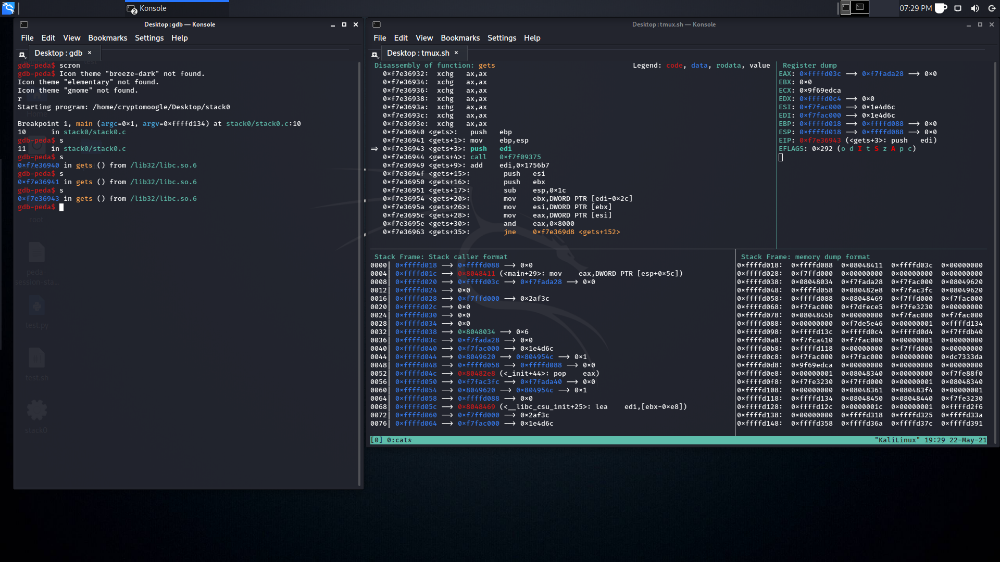

# PEDA-Screen
PEDA - Python Exploit Development Assistance for GDB
- - -
## Changes Made
A hacky screen extension for use with gdb-peda.
Moves the inline disassambly, register and stack views into a seperate tmux seperated screen.
* Commands to use the screen extension:
  * `scron` -- turns on the the screen extension and moves the inline debugger info to a newly opened tmux seperated screen
  * `scrclr` -- clears the debugger info screen
  * `scroff` -- turns off the the screen extension and moves the inline debugger info back to the main screen

## Issues
Requires the "remember window size option to be disabled in konsole, "settings -> configure konsole -> general"
The screen extension is currently hardcoded for use with the konsole terminal emulator and requires the terminal that is running gdb-peda to be using /dev/pts/0 and have no other pts devices in use.

## Todo
* add dynamic support for all terminal emulators
* remove dependancy on the terminal running gdb-peda to use /dev/pts/0
* remove requirment for only one terminal to be in use prior to screen extenions being run
- - -
## Key Features:
* Enhance the display of gdb: colorize and display disassembly codes, registers, memory information during debugging.
* Add commands to support debugging and exploit development (for a full list of commands use `peda help`):
  * `aslr` -- Show/set ASLR setting of GDB
  * `checksec` -- Check for various security options of binary
  * `dumpargs` -- Display arguments passed to a function when stopped at a call instruction
  * `dumprop` -- Dump all ROP gadgets in specific memory range
  * `elfheader` -- Get headers information from debugged ELF file
  * `elfsymbol` -- Get non-debugging symbol information from an ELF file
  * `lookup` -- Search for all addresses/references to addresses which belong to a memory range
  * `patch` -- Patch memory start at an address with string/hexstring/int
  * `pattern` -- Generate, search, or write a cyclic pattern to memory
  * `procinfo` -- Display various info from /proc/pid/
  * `pshow` -- Show various PEDA options and other settings
  * `pset` -- Set various PEDA options and other settings
  * `readelf` -- Get headers information from an ELF file
  * `ropgadget` -- Get common ROP gadgets of binary or library
  * `ropsearch` -- Search for ROP gadgets in memory
  * `searchmem|find` -- Search for a pattern in memory; support regex search
  * `shellcode` -- Generate or download common shellcodes.
  * `skeleton` -- Generate python exploit code template
  * `vmmap` -- Get virtual mapping address ranges of section(s) in debugged process
  * `xormem` -- XOR a memory region with a key

## Installation

    git clone https://github.com/longld/peda.git ~/peda
    echo "source ~/peda/peda.py" >> ~/.gdbinit
    echo "DONE! debug your program with gdb and enjoy"

## Screenshot

